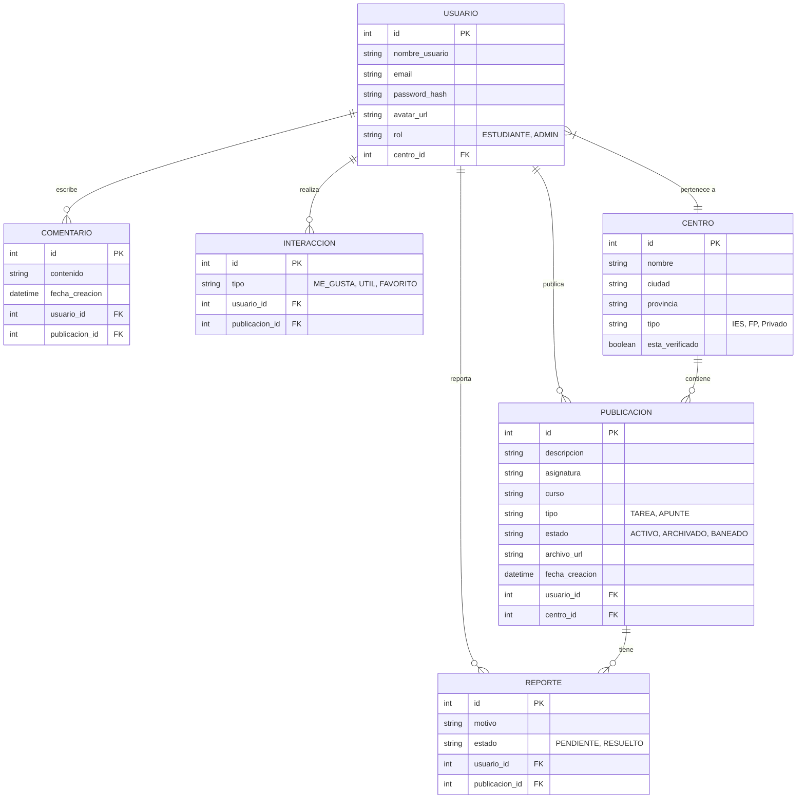
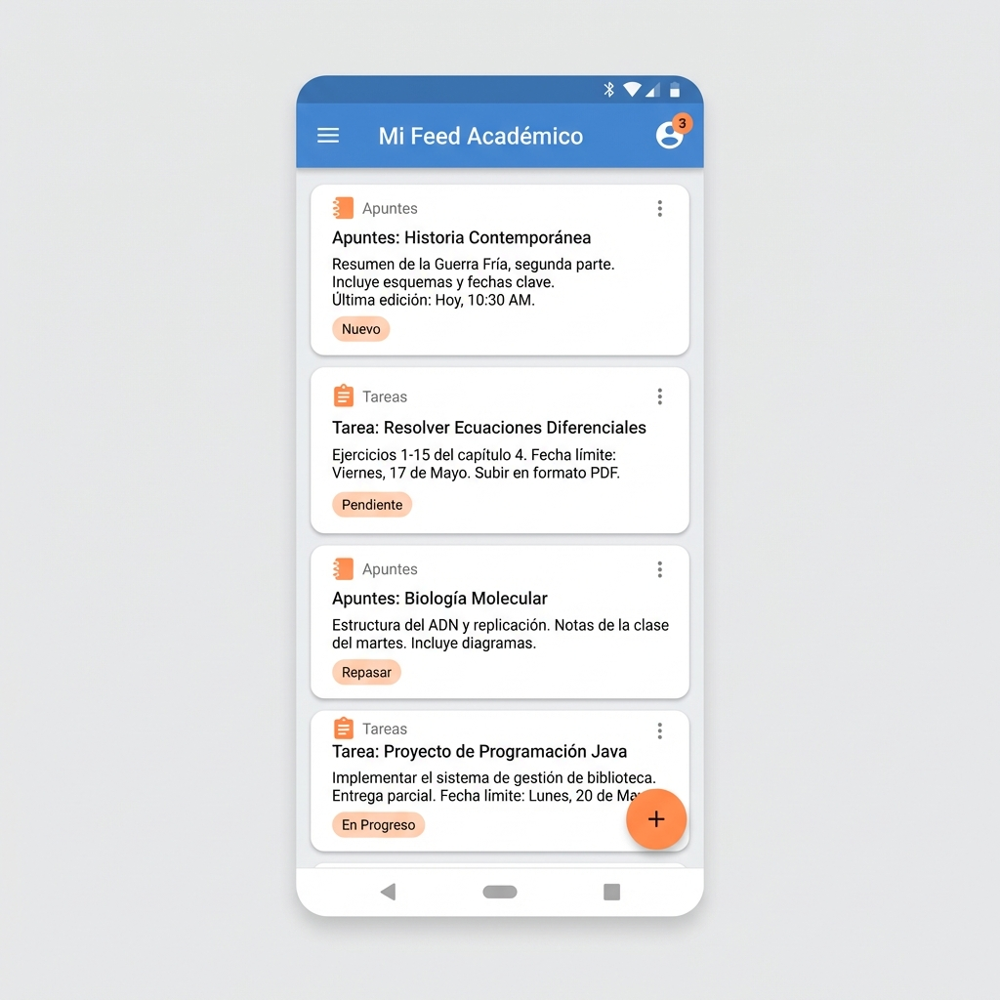
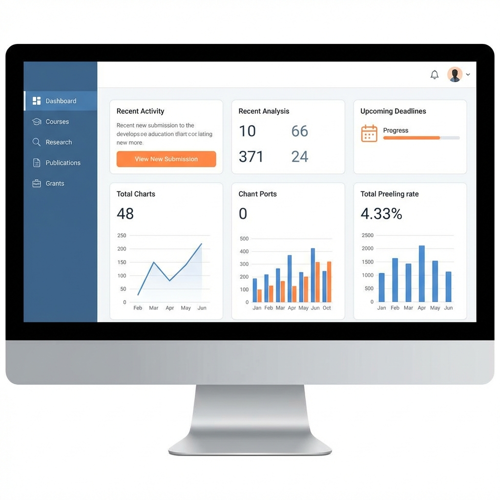

# 📱 Proyecto Final DAM: App Colaborativa Multi-Plataforma

Este repositorio contiene el código y documentación para una aplicación de gestión académica colaborativa desarrollada con **Android Studio**, **Django** y **React**.

## 👥 Equipo de Desarrollo

- **Antonio** - Android Development
- **Jorge** - Android Development  
- **Cristian** - Android Development

## 🏗️ Estructura del Proyecto

```
DAM-Proyecto-Final/
├── android/          # 📱 Aplicación móvil nativa (Android Studio)
├── django-backend/   # 🔧 API REST y Backend (Django + DRF)
├── react-frontend/   # 🌐 Aplicación web (React)
└── docs/            # 📚 Documentación técnica
    ├── android-plan.md    # Plan de desarrollo Android
    ├── git-guide.md       # Guía de Git/GitHub
    └── images/            # Mockups y capturas
```

## 🚀 Guías de Inicio Rápido

### Para Desarrolladores Android
1. Lee [`docs/android-plan.md`](docs/android-plan.md) para conocer tu asignación de tareas
2. Lee [`docs/git-guide.md`](docs/git-guide.md) para configurar Git
3. Crea tu rama de trabajo: `git checkout -b feature/dev#-nombre-funcionalidad`

### Configuración Inicial
```bash
# Clonar el repositorio
git clone git@github.com:Antoniomba23/PROYECTO-FINAL-ANDROID-SEGUNDO-DAM.git
cd PROYECTO-FINAL-ANDROID-SEGUNDO-DAM

# Crear tu rama de trabajo
git checkout -b feature/tu-nombre-funcionalidad

# Ver documentación
cat docs/android-plan.md
```

---

## 📋 Visión del Producto

## 1. Análisis y Requisitos

### Visión del Producto
Una plataforma centralizada donde estudiantes de distintos centros educativos (IES, FP, Academias) pueden compartir, organizar y validar material académico (apuntes, tareas) para evitar la pérdida de información entre cursos y fomentar la colaboración.

### Tipos de Usuario ("Persona")
*   **El Alumno Colaborador (User Persona)**: Estudiante de FP o Bachillerato, tecnológicamente activo, que busca material de años anteriores para estudiar o quiere compartir sus soluciones para ganar reputación. Valora el orden y la facilidad de búsqueda.
*   **El Administrador**: Encargado de validar la veracidad de los centros registrados y moderar contenido inapropiado.

### Diseño UI/UX
*   **Paradigma**: Google Material Design 3.
*   **Paleta de Colores**:
    *   *Primary*: Azul Acero (`#4A90E2`) - Confianza y calma.
    *   *Secondary*: Naranja Suave (`#FF8C42`) - Creatividad y acción.
    *   *Background*: Blanco Humo (`#F5F5F5`) - Limpieza.
*   **Tipografía**: `Roboto` (Android standard) y `Inter` (Web).
*   **Componentes Clave**:
    *   *Cards* para publicaciones (Título, Tags, Usuario, Acciones).
    *   *Floating Action Button (FAB)* para subir nuevo contenido.
    *   *Navigation Bar/Rail* para navegación principal.

### Especificaciones Técnicas (Android)
*   **Arquitectura**: MVVM (Model-View-ViewModel) + Repository Pattern.
*   **Componentes UI**:
    *   **Fragments**: Gestión de navegación entre pantallas principales (Home, Perfil, Buscador).
    *   **RecyclerView**: Visualización eficiente de listados de apuntes y comentarios.
    *   **Layouts**: XML layouts con ConstraintLayout y Material Components.
*   **Networking**: Retrofit para consumo de API Rest.


---

## 2. Modelo Entidad-Relación (ERD)



---

## 3. Historias de Usuario y API Rest

A continuación se detallan las historias de usuario principales y los endpoints necesarios para satisfacerlas.

| ID | Historia de Usuario | Endpoint(s) Asociado(s) |
|----|---------------------|-------------------------|
| **HU-01** | Como alumno, quiero registrarme y seleccionar mi centro para poder acceder al contenido. | `POST /api/auth/register`<br>`GET /api/centers` |
| **HU-02** | Como alumno, quiero ver un listado de publicaciones de mi centro filtradas por asignatura para estudiar eficiente. | `GET /api/posts?center_id={id}&subject={name}` |
| **HU-03** | Como alumno, quiero subir un PDF con mis apuntes para compartirlos con la clase. | `POST /api/posts` (Multipart/form-data) |
| **HU-04** | Como alumno, quiero comentar en una publicación para resolver una duda sobre la tarea. | `POST /api/posts/{id}/comments` |
| **HU-05** | Como alumno, quiero marcar como "útil" un apunte para agradecer al autor. | `POST /api/posts/{id}/interactions` |
| **HU-06** | Como admin, quiero validar una solicitud de nuevo centro para que aparezca en el listado oficial. | `PATCH /api/centers/{id}/verify` |

---

## 4. Prototipo Visual (Mockups)

> **Nota sobre Herramientas**: Para este Sprint I, se ha optado por **Mockups de Alta Fidelidad** generados digitalmente. Esta elección se justifica por la necesidad de iterar rápidamente sobre los conceptos de *Material Design 3* y visualizar el producto final antes de la implementación técnica en Figma o Android Studio.


### App Android
**Login Screen**
Diseño limpio minimalista centrado en el acceso rápido.


**Register Screen**
Diseño limpio minimalista centrado en el acceso rápido.


**Home Screen (Feed)**
Listado de apuntes filtrados por centro, tarjetas con información clave (Asignatura, Autor).

### Subir apuntes

Esto será una ventana que se nos abrirá cuando queramos crear una nuevo apunte o una nueva tarea, si le pulsamos al símbolito de (+)


**Menú Centros**
La página principal de todos los centros de una api, con numerosas tarjetas, indicando su nombre, que tipo de centro son, y si son públicos o privados


**Menú  de especialidades **
La página principal de un centro con todas sus especialidades, y si son de formación profesional o grado universitario


**Menú  de Foros **
 cuanto te metes a una especialidad, aparecen una serie de diferentes apuntes en los que tambieén hay foros para que los usuarios puedan dar su opinión, 


**Detail Screen**
Vista detallada del apunte con previsualización de archivo y sección de comentarios.


### Menú Hamburguesa 
Será un menú de tipo Hamburguesa que estará presente en la pantalla principal, con diferentes apartados


### Perfil
Este será la imagen del perfil del usuario


### App Web (React)
**Dashboard de Escritorio**
Vista adaptada para pantallas grandes con navegación lateral y gestión de contenido.



### Autores
Proyecto desarrollado por Antonio, Jorge y Cristian como proyecto final de Programación Multimedia y de Dispositivos Móviles, DAM 2º curso.
