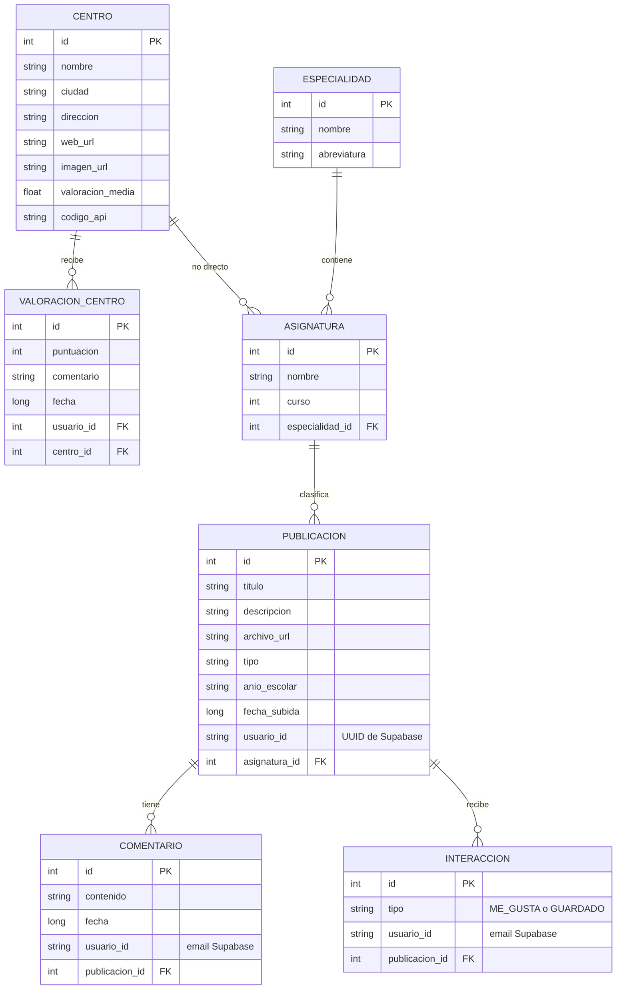

# StudyBro — Aplicación Android para compartir material académico

Proyecto final del ciclo de Desarrollo de Aplicaciones Multiplataforma (DAM), 2.º curso.
Desarrollado por Antonio, Jorge y Cristian.

---

## Descripción

StudyBro es una aplicación Android nativa para que estudiantes de FP compartan apuntes, exámenes y dudas organizados por centro educativo y asignatura. La idea es que el material que se sube en un curso quede disponible para los alumnos del siguiente, evitando que se pierda de un año para otro.

Los usuarios pueden registrarse y loguarse, seleccionar su centro educativo, buscar publicaciones por asignatura, añadir comentarios, marcar publicaciones como útiles o guardarlas en favoritos, y subir sus propios apuntes o archivos.

---

## Tecnologías usadas

### Android (principal)

- Java, Android Studio
- Room (base de datos local SQLite)
- Retrofit (peticiones HTTP a la API de Madrid y a Supabase)
- Material Design 3 (componentes UI: Cards, NavigationDrawer, Chips, etc.)
- **Google Gemini AI** (Asistente inteligente mediante IA generativa)
- Supabase Auth (autenticación de usuarios)
- Supabase Storage (almacenamiento de archivos subidos)
- SharedPreferences (sesión del usuario y centro seleccionado)

### Backend / Datos externos

- Supabase (autenticación, base de datos y almacenamiento de archivos)
- API pública de datos abiertos de la Comunidad de Madrid (catálogo de centros educativos)

---

## Funcionalidades implementadas

### Autenticación

- Registro e inicio de sesión mediante email y contraseña (Supabase Auth)
- Persistencia de sesión con SharedPreferences
- Cierre de sesión con confirmación

### Selección de centro

- Al iniciar sesión por primera vez, el usuario puede buscar y seleccionar su centro educativo
- Los centros se cargan desde la API de Madrid y se guardan localmente en Room
- La selección queda guardada y puede modificarse desde el menú lateral

### Navegación principal (menú hamburguesa)

- Navigation Drawer con acceso a: Inicio, Publicaciones, Mi Perfil, Iniciar sesión / Cerrar sesión, Cambiar centro
- La cabecera del drawer muestra el email y el centro del usuario si hay sesión activa
- Las opciones de perfil y cambiar centro solo aparecen si el usuario ha iniciado sesión

### Publicaciones

- Listado de publicaciones filtrables por asignatura
- Formulario para crear nueva publicación: título, descripción, tipo (apunte, examen, duda, tarea), asignatura y archivo adjunto
- Los archivos se suben a Supabase Storage

### Pantalla de detalle de publicación

- Muestra los datos completos de la publicación
- Botón "Útil" (like) y "Favorito": si ya has marcado uno, vuelve a pulsarlo para quitarlo, con contador en tiempo real
- Sección de comentarios: lista con autor y fecha relativa, campo de texto para añadir uno nuevo

### Perfil de usuario

- Muestra el nombre, email y centro asignado
- Estadísticas: número de publicaciones propias, likes recibidos y favoritos recibidos
- Lista de las publicaciones del usuario
- Acceso directo a crear nueva publicación
- Botón de cerrar sesión con diálogo de confirmación

### Inteligencia Artificial (StudyBot)

- Botón flotante asistido por **Google Gemini AI**
- Capacidad para resolver dudas académicas y resumir contenido de las publicaciones
- Interfaz de chat integrada en la aplicación

### Panel de Administración (Cloud)

- **Moderación**: Validación de sugerencias de centros, especialidades y asignaturas enviadas por usuarios
- **Gestión de Usuarios**: Sincronización completa con la nube, cambio de roles (Admin/Estudiante) y eliminación de cuentas directamente desde la app

### Base de datos local (Room)

- Entidades: Centro, Especialidad, Asignatura, Publicacion, Comentario, Interaccion, ValoracionCentro
- Seeder automático que rellena las asignaturas y especialidades de DAM y DAW si la BD está vacía

---

## Estructura del proyecto

```
android/
  app/src/main/java/com/dam/studybro/
    activities/         -- Todas las pantallas (Activities)
    adapters/           -- Adaptadores para los RecyclerView
    database/           -- Entidades Room, DAOs y DatabaseSeeder
    modelos/            -- Modelos para la respuesta de la API externa
    red/                -- Cliente Retrofit para la API de Madrid
    supabase/           -- Cliente Retrofit para Supabase
```

## Modelo de base de datos (Room)

La base de datos local usa Room sobre SQLite. La autenticación la gestiona Supabase, por lo que la tabla `usuarios` existe pero el identificador de usuario en publicaciones, comentarios e interacciones es el email de Supabase tipo String, no una clave foránea local.


```mermaid
erDiagram
    CENTRO ||--o{ VALORACION_CENTRO : "recibe"
    CENTRO ||--o{ ASIGNATURA : "no directo"
    ESPECIALIDAD ||--o{ ASIGNATURA : "contiene"
    ASIGNATURA ||--o{ PUBLICACION : "clasifica"
    PUBLICACION ||--o{ COMENTARIO : "tiene"
    PUBLICACION ||--o{ INTERACCION : "recibe"

    CENTRO {
        int id PK
        string nombre
        string ciudad
        string direccion
        string web_url
        string imagen_url
        float valoracion_media
        string codigo_api
    }

    ESPECIALIDAD {
        int id PK
        string nombre
        string abreviatura
    }

    ASIGNATURA {
        int id PK
        string nombre
        int curso
        int especialidad_id FK
    }

    PUBLICACION {
        int id PK
        string titulo
        string descripcion
        string archivo_url
        string tipo
        string anio_escolar
        long fecha_subida
        string usuario_id "UUID de Supabase"
        int asignatura_id FK
    }

    COMENTARIO {
        int id PK
        string contenido
        long fecha
        string usuario_id "email Supabase"
        int publicacion_id FK
    }

    INTERACCION {
        int id PK
        string tipo "ME_GUSTA o GUARDADO"
        string usuario_id "email Supabase"
        int publicacion_id FK
    }

    VALORACION_CENTRO {
        int id PK
        int puntuacion
        string comentario
        long fecha
        int usuario_id FK
        int centro_id FK
    }
```

La tabla `usuarios` de Room existe pero no se usa para el login (ese rol lo cubre Supabase Auth). El centro y la sesion del usuario se almacenan en SharedPreferences.

---

## Pantallas de la aplicación

| Pantalla | Clase |
|---|---|
| Pantalla principal (lista de centros) | `ActividadPrincipal` |
| Login | `ActividadLogin` |
| Registro | `ActividadRegistro` |
| Seleccionar centro | `ActividadSeleccionarCentro` |
| Lista de publicaciones | `ActividadPublicaciones` |
| Detalle de publicación | `ActividadDetalle` |
| Nueva publicación | `ActividadNuevaPublicacion` |
| Perfil de usuario | `ActividadPerfil` |
| Perfil de centro | `ActividadPerfilCentro` |
| Asignaturas | `ActividadAsignaturas` |
| Gestión de Usuarios (Admin) | `ActividadGestionUsuarios` |
| Moderación de Sugerencias (Admin) | `ActividadModerarSugerencias` |
| Sugerir Entidad | `ActividadSugerirEntidad` |

---

## Configuración del entorno

Clonar el repositorio y abrirlo con Android Studio. Sincronizar dependencias con Gradle. No es necesario configurar ningún archivo de entorno adicional, las claves de Supabase están incluidas en el código para facilitar la corrección.

```bash
git clone https://github.com/Antoniomba23/PROYECTO-FINAL-ANDROID-SEGUNDO-DAM.git
```

Conectar un dispositivo físico o iniciar un emulador con API 29 o superior y pulsar Run.

---

## Autor

- Antonio Mba Nzang

2.º DAM — Proyecto Final de Programación Multimedia y Dispositivos Móviles
