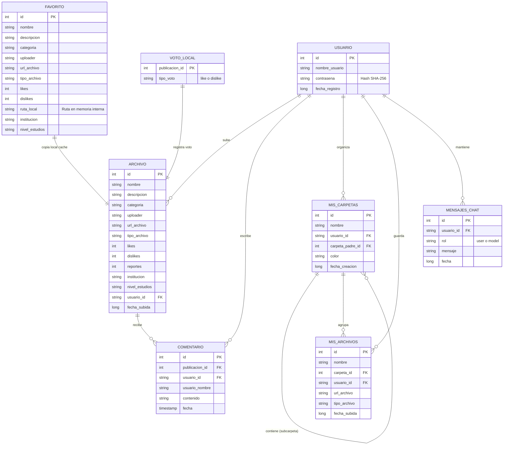

# StudyFiles — Gestor de Apuntes y Nube Colaborativa

Aplicación Android nativa diseñada para que estudiantes compartan material académico, organicen una nube personal de carpetas y archivos, y cuenten con la asistencia en tiempo real de un Tutor Virtual educativo.

Proyecto final del ciclo de Desarrollo de Aplicaciones Multiplataforma (DAM), 2.º curso.

---

## Descripción General

**StudyFiles** es un completo gestor documental y biblioteca académica colaborativa para dispositivos Android. Su objetivo es doble:
1. **Biblioteca Colaborativa (Pública):** Permitir que los estudiantes compartan apuntes, exámenes, guías y recursos organizados por asignaturas y categorías (Historia, Informática, Matemáticas, etc.), asegurando que el conocimiento fluya de curso en curso.
2. **Mi Nube (Privada):** Ofrecer un espacio privado de almacenamiento en la nube donde cada alumno puede crear directorios estructurados (carpetas y subcarpetas con colores personalizados) y subir archivos personales para consultarlos en cualquier momento.

La aplicación incluye un **Tutor Virtual de Apoyo** con el que conversar para resolver dudas y buscar material académico relevante de la biblioteca en base a palabras clave. También ofrece un sistema robusto de sesión de invitado con migración automatizada de datos a la nube cuando el usuario decida registrarse.

---

## Tecnologías y Stack Técnico

- **Android SDK:** Java nativo, Android 14 (API 34, compatible con min SDK 24).
- **Persistencia Local (Room ORM):** Base de datos SQLite local utilizada para la caché de favoritos (permitiendo consultar y abrir apuntes descargados sin conexión a internet) y para evitar votos duplicados.
- **Base de Datos y Almacenamiento Remoto (Supabase):**
  - **Supabase REST API:** Para consultar y gestionar apuntes públicos, comentarios, carpetas y archivos personales.
  - **Supabase Storage:** Gestión de almacenamiento tipo bucket para subir y descargar archivos en la nube.
- **Red y Conectividad (Retrofit 2 & OkHttp 3):** Cliente HTTP estructurado para consumir la API de Supabase y conectarse a servicios remotos.
- **Asistente Virtual (Generative Language API):** API generativa externa para el procesamiento del chat con el Tutor Virtual de Apoyo, que inyecta automáticamente contexto dinámico del repositorio a partir de las consultas del usuario.
- **Carga de Imágenes (Glide):** Librería para la renderización optimizada de miniaturas y vistas previas.
- **Diseño Visual (Material Design 3):** Interfaz intuitiva y moderna con persistencia local de modo claro/oscuro.

---

## Funcionalidades Principales

### 1. Nube Académica Colaborativa
- **Buscador Avanzado:** Filtro inteligente de apuntes compartidos por título, descripción y categorías.
- **Detalle de Archivos:** Vista completa del documento con información del uploader, institución de origen, nivel de estudios y valoraciones.
- **Sistema de Votación (Likes / Dislikes):** Permite valorar los archivos útiles. Los votos se registran localmente (Room) para impedir duplicidades y se actualizan en tiempo real en la base de datos de Supabase.
- **Moderación Comunitaria:** Si un archivo acumula un número crítico de reportes por parte de la comunidad, se elimina de forma automática de los servidores públicos para asegurar la calidad del repositorio.
- **Marcado de Favoritos Offline:** Al añadir un apunte a favoritos, este se descarga automáticamente en el almacenamiento interno privado del dispositivo. El usuario podrá acceder al listado de favoritos y abrir sus documentos directamente con el FileProvider incluso cuando no disponga de conexión a internet.
- **Foro de Comentarios:** Hilo interactivo en cada apunte para debatir y resolver dudas. Los usuarios registrados pueden añadir comentarios, y también editarlos o eliminarlos directamente si son autores de las respuestas.

### 2. Mi Nube (Gestor Personal Privado)
- **Estructura de Directorios:** Creación de carpetas y subcarpetas ilimitadas con colores asignados al azar para una organización visual atractiva.
- **Subida de Archivos:** Carga de documentos de cualquier formato (PDF, imágenes, documentos de texto Word, Excel o comprimidos ZIP) directamente al bucket personal de Supabase.
- **Gestión Completa:** Opciones para renombrar carpetas o eliminar archivos y directorios con confirmación en cascada.

### 3. Tutor Virtual de Apoyo (Asistente RAG Inteligente)
- **Chat Contextual:** Ventana interactiva de mensajería con un tutor académico especializado en StudyFiles.
- **Inyección de Apuntes (RAG):** El sistema analiza el mensaje enviado por el usuario, extrae palabras clave útiles y realiza una búsqueda paralela en la base de datos de archivos públicos de Supabase. Si encuentra recursos relevantes, los inyecta en el contexto de la consulta para que el tutor los mencione en su respuesta con un enlace especial clickable (`[file:ID:NOMBRE]`).
- **Navegación Directa:** Al pulsar sobre una referencia a un archivo dentro de la burbuja de chat, la app redirige de inmediato a la pantalla de detalle de ese apunte.
- **Control de Historial:** Persistencia de mensajes en la nube y opción de borrar por completo la conversación cuando el usuario lo prefiera.

### 4. Sesión de Invitado y Sincronización Automática
- **Uso sin Cuenta:** La app permite acceder como invitado de forma inmediata, autogenerando un identificador UUID local.
- **Migración Inteligente:** El historial del tutor, las carpetas y archivos creados en "Mi Nube", y los aportes públicos subidos como invitado se asocian a este UUID local. En el momento en que el usuario decide registrarse o iniciar sesión, el sistema realiza una migración transparente en la base de datos remota, actualizando los registros al nuevo identificador permanente (`user_ID`) y sincronizando todos sus datos sin que pierda nada de su progreso previo.

---

## Estructura del Proyecto

El código fuente de la aplicación Android se organiza dentro del subdirectorio `studyfiles/app/src/main/java/com/dam/studyfiles/` estructurado en los siguientes paquetes de Java:

```text
com/dam/studyfiles/
  ├── activities/   # Pantallas (Activities) que gestionan las vistas y flujos de usuario.
  ├── adapters/     # Adaptadores personalizados de RecyclerView (carpetas, archivos, chat, comentarios).
  ├── database/     # Entidades Room (Favorito, VotoLocal), DAOs y el singleton de la base de datos local.
  ├── models/       # Modelos POJO de datos utilizados por las APIs y componentes (Archivo, MiCarpeta, etc.).
  ├── network/      # Cliente HTTP de Retrofit, endpoints de Supabase, cuenta de usuario y mensajería.
  └── utils/        # Clases de soporte general (encriptación hash, gestión de archivos, y el asistente virtual).
```

---

## Modelo de Base de Datos

La base de datos local (Room) actúa como caché de favoritos y registro de votos locales, mientras que Supabase gestiona de forma centralizada los usuarios, archivos, carpetas, comentarios y mensajes del chat.


```mermaid
erDiagram
    %% Base de datos remota en Supabase
    USUARIO ||--o{ ARCHIVO : "sube"
    USUARIO ||--o{ COMENTARIO : "escribe"
    USUARIO ||--o{ MIS_CARPETAS : "organiza"
    USUARIO ||--o{ MIS_ARCHIVOS : "guarda"
    USUARIO ||--o{ MENSAJES_CHAT : "mantiene"

    ARCHIVO ||--o{ COMENTARIO : "recibe"
    MIS_CARPETAS ||--o{ MIS_CARPETAS : "contiene (subcarpeta)"
    MIS_CARPETAS ||--o{ MIS_ARCHIVOS : "agrupa"

    %% Base de datos local (Room)
    FAVORITO ||--|| ARCHIVO : "copia local cache"
    VOTO_LOCAL ||--|| ARCHIVO : "registra voto"

    USUARIO {
        int id PK
        string nombre_usuario
        string contrasena "Hash SHA-256"
        long fecha_registro
    }

    ARCHIVO {
        int id PK
        string nombre
        string descripcion
        string categoria
        string uploader
        string url_archivo
        string tipo_archivo
        int likes
        int dislikes
        int reportes
        string institucion
        string nivel_estudios
        string usuario_id FK
        long fecha_subida
    }

    COMENTARIO {
        int id PK
        int publicacion_id FK
        string usuario_id FK
        string usuario_nombre
        string contenido
        timestamp fecha
    }

    MIS_CARPETAS {
        int id PK
        string nombre
        string usuario_id FK
        int carpeta_padre_id FK
        string color
        long fecha_creacion
    }

    MIS_ARCHIVOS {
        int id PK
        string nombre
        int carpeta_id FK
        string usuario_id FK
        string url_archivo
        string tipo_archivo
        long fecha_subida
    }

    MENSAJES_CHAT {
        int id PK
        string usuario_id FK
        string rol "user o model"
        string mensaje
        long fecha
    }

    FAVORITO {
        int id PK
        string nombre
        string descripcion
        string categoria
        string uploader
        string url_archivo
        string tipo_archivo
        int likes
        int dislikes
        string ruta_local "Ruta en memoria interna"
        string institucion
        string nivel_estudios
    }

    VOTO_LOCAL {
        int publicacion_id PK
        string tipo_voto "like o dislike"
    }
```

---

## Pantallas de la Aplicación

| Pantalla | Clase Java | Descripción |
|---|---|---|
| **Pantalla Principal** | [ActividadPrincipal](file:///d:/DAM/Rutas%20y%20Proyectos/Proyectos/DAM%20Proyecto%20Final/studyfiles/app/src/main/java/com/dam/studyfiles/activities/ActividadPrincipal.java) | Vista unificada de inicio con selector de categorías, buscador, panel de "Mi Nube", "Favoritos", acceso a login y botón del chat del Tutor. |
| **Explorador por Categorías** | [ActividadArchivos](file:///d:/DAM/Rutas%20y%20Proyectos/Proyectos/DAM%20Proyecto%20Final/studyfiles/app/src/main/java/com/dam/studyfiles/activities/ActividadArchivos.java) | Muestra el listado de archivos correspondientes a la asignatura o área de conocimiento seleccionada. |
| **Detalle de Archivo** | [ActividadDetalle](file:///d:/DAM/Rutas%20y%20Proyectos/Proyectos/DAM%20Proyecto%20Final/studyfiles/app/src/main/java/com/dam/studyfiles/activities/ActividadDetalle.java) | Visualización completa del apunte, panel de votos, botón de favoritos con descarga interna, y el foro de comentarios con herramientas de edición/borrado. |
| **Carpeta de Mi Nube** | [ActividadCarpeta](file:///d:/DAM/Rutas%20y%20Proyectos/Proyectos/DAM%20Proyecto%20Final/studyfiles/app/src/main/java/com/dam/studyfiles/activities/ActividadCarpeta.java) | Panel para recorrer subcarpetas y subir o eliminar archivos en una determinada ruta del almacenamiento privado. |
| **Formulario de Subida** | [ActividadSubir](file:///d:/DAM/Rutas%20y%20Proyectos/Proyectos/DAM%20Proyecto%20Final/studyfiles/app/src/main/java/com/dam/studyfiles/activities/ActividadSubir.java) | Pantalla de publicación para subir archivos de estudio compartidos con la comunidad, indicando nivel de estudios y centro. |
| **Chat de Asistencia** | [ActividadChat](file:///d:/DAM/Rutas%20y%20Proyectos/Proyectos/DAM%20Proyecto%20Final/studyfiles/app/src/main/java/com/dam/studyfiles/activities/ActividadChat.java) | Interfaz de mensajería bidireccional con el Tutor Virtual de Apoyo, que integra búsqueda de apuntes automatizada en tiempo real. |
| **Login / Registro** | [ActividadLogin](file:///d:/DAM/Rutas%20y%20Proyectos/Proyectos/DAM%20Proyecto%20Final/studyfiles/app/src/main/java/com/dam/studyfiles/activities/ActividadLogin.java) | Creación y autenticación de perfiles con sincronización y migración automática de datos almacenados localmente de modo invitado. |

---

## Configuración y Compilación

1. Abre el subdirectorio `studyfiles` como un proyecto existente en **Android Studio**.
2. Deja que Gradle sincronice las dependencias automáticas configuradas en el archivo `build.gradle` del módulo `app`.
3. Para habilitar la asistencia inteligente del Tutor Virtual, asegúrate de añadir tu clave de API en el archivo `local.properties` (ubicado en la raíz de la carpeta `studyfiles`) con el siguiente nombre:
   ```properties
   GEMINI_API_KEY=TU_API_KEY_AQUÍ
   ```
4. Conecta un dispositivo físico Android (con depuración USB activa) o inicia un Emulador con la API 24 (Android 7.0) o superior.
5. Pulsa el botón **Run app** (flecha verde superior) para compilar y desplegar la aplicación.

---

## Autores y Créditos

- **Antonio Mba Nzang**
- 2.º DAM — Proyecto Final de Programación Multimedia y Dispositivos Móviles.
